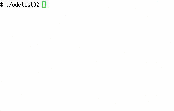

odetest
====
ODE(Open Dynamics Engine)
  - http://ode.org/

    
How to
----

    $ sudo apt-get install libode-dev cmake
	$ git clone https://github.com/yoggy/odetest.git
    $ cd odetes
    $ cmake .
    $ make
    $ ./odetest02

Copyright and license
----
Copyright (c) 2015 yoggy

Released under the [MIT license](LICENSE.txt)

